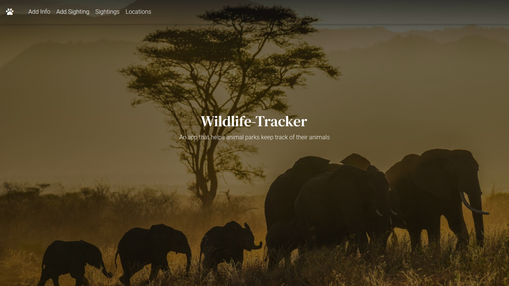
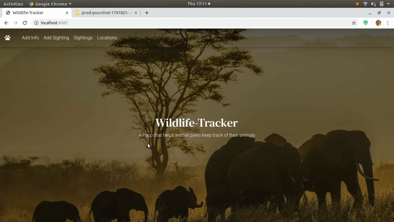

# Wildlife-Tracker

## By **Nathan Ng'ethe** Version: 1.0.

## Description
This is an awesome app that helps rangers and animal parks as a whole keep track of animals in their park. Through this they can monitor the population of animals and get urgent animal data anytime, anywhere.

## Features
* Add info such as animals, species, rangers and locations within the park.
* Add a sighting by the info available and add a picture of the animal.
* Check all sightings and filter them by the most recent.

## Behaviour Driven Development(BDD)
| Project should handle : | Input example :     | Output example : |
| :------------- | :------------- | :-------------         |
| Adding various types of info       | Add the animal, Lion to the animal info form       | Lion added and a lion sighting can easily be made    |
| Add a sighting       | Enter required info to the sightings form      | Sighting is added and can be viewed in the sightings page    |
| Sort by most recent       | Click the filter icon       | Sightings are filtered from the most recent    |

## Installation
1. Clone the repo `git clone https://github.com/lendilai/Wildlife-tracker.git`
2. CD into the folder `cd Wildlife-tracker`

## Setup instructions for the database
1. First make sure that you have postgres installed.
   If not, run:
   ```bash

   $ sudo apt update
   $ sudo apt install postgresql postgresql-contrib

    ```
2. Run the following commands in the Wildlife-tracker folder-

```bash

$ psql //Launches Postgres
# CREATE DATABASE wildlife_tracker
# \c wildlife_tracker
# CREATE TABLE animals(id SERIAL PRIMARY KEY, the_name VARCHAR, endangered boolean);
# CREATE TABLE species(id SERIAL PRIMARY KEY, the_name VARCHAR);
# CREATE TABLE rangers(id SERIAL PRIMARY KEY, ranger VARCHAR, badge int);
# CREATE TABLE locations(id SERIAL PRIMARY KEY, location VARCHAR);
# CRETE TABLE sightings(id SERIAL PRIMARY KEY, ranger_id VARCHAR, species_id VARCHAR, animal_id VARCHAR,location_id VARCHAR, health VARCHAR, age VARCHAR, sighted_on timestamp);
# CREATE TABLE wildlife_tracker_test WITH TEMPLATE wildlife_tracker;

```

## Demo


## Technologies used
- [Java](https://www.java.com/) - This was used to ensure functionality.

## Known bugs
As of now there are no known bugs. If you come across any bugs feel free to contact me.

## Contact Information
You can contact me via my gmail account at ngethenan768@gmail.com.

## License
The application is under an [MIT license](https://github.com/lendilai/Wildlife-tracker/blob/master/License).